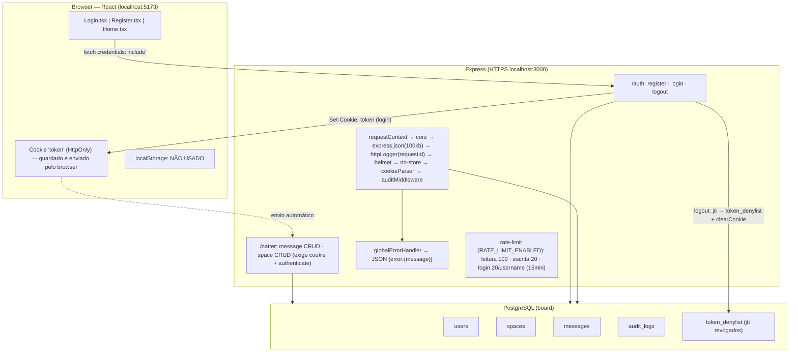
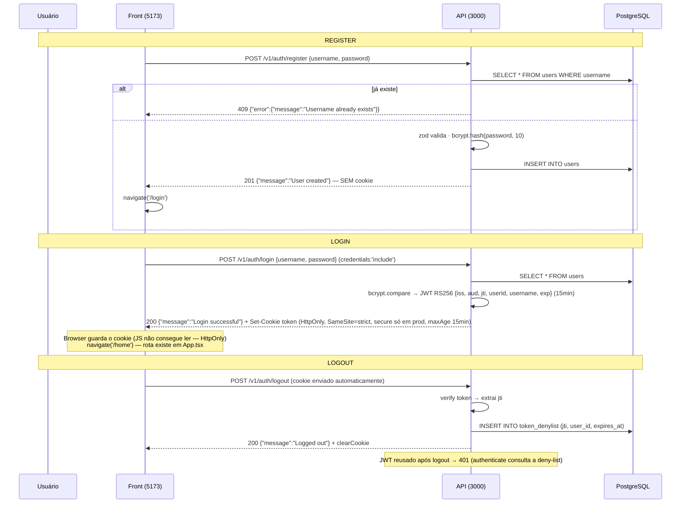

# Fluxos de dados e da API

## 1. Fluxo de dados geral

## 2. Sequência register → login → logout

## 3. O que cada endpoint retorna

| Endpoint | Auth | Body/Query | Sucesso | Erros |
|---|---|---|---|---|
| POST `/v1/auth/register` | — | `{username, password}` (zod, strict) | **201** `{message:"User created"}` | 400 validação · 409 `Username already exists` |
| POST `/v1/auth/login` | — | `{username, password}` | **200** `{message:"Login successful"}` + **Set-Cookie `token`** | 400 · 401 `Invalid credentials` · 429 |
| POST `/v1/auth/logout` | cookie (opcional) | — | **200** `{message:"Logged out"}` + revoga o token | — |
| POST `/v1/natter/message` | cookie | `{content, space_id}` (`author` vem da sessão) | **200** `{id, author, content, msg_time, space_id}` | 400 · 401 · 429 |
| GET `/v1/natter/message?limit&offset` | cookie | `limit` 1–100 (default 20), `offset` ≥ 0 | **200** `[{id, author, content, msg_time, space_id}]` | 400 query inválida · 401 |
| GET `/v1/natter/message/:id` | cookie | — | **200** `{id, author, content, msg_time, space_id}` | 400 id inválido · 401 · 404 (não é seu) |
| PUT `/v1/natter/message/:id` | cookie | `{content}` | **200** `{...message}` | 400 · 401 · 404 |
| DELETE `/v1/natter/message/:id` | cookie | — | **204** corpo vazio | 400 · 401 · 404 |
| POST `/v1/natter/space` | cookie | `{name}` (`owner` vem da sessão) | **200** `{id, name, owner}` | 400 · 401 · 429 |
| GET `/v1/natter/space?limit&offset` | cookie | idem message | **200** `[{id, name, owner}]` | 400 · 401 |
| GET `/v1/natter/space/:id` | cookie | — | **200** `{id, name, owner}` | 400 · 401 · 404 |
| DELETE `/v1/natter/space/:id` | cookie | — | **204** | 400 · 401 · 404 |

## 4. Sessão, JWT e cookies

- **Único mecanismo de sessão: cookie `token`** (JWT RS256, 15min), setado pelo back no login. `HttpOnly` → o JS do front não lê nem altera; o browser envia sozinho nas requests para `localhost:3000`.
- **Contrato do token (claims)**: `iss` = `JWT_ISSUER` (default `natter-api`), `aud` = `JWT_AUDIENCE` (default `natter-web`), `jti` (UUID único por login), `userId`, `username`, `iat`, `exp`. `verify` valida assinatura (RS256 fixo), `iss`, `aud` e `exp`.
- **Revogação**: `logout` insere o `jti` na tabela `token_denylist` (expira junto com o token); `authenticate` rejeita com 401 qualquer token presente na deny-list.
- **localStorage: não existe** em nenhum arquivo do front; `Home` é estática e o front **nunca chama** os endpoints `/natter` hoje.
- **Rate limit** (flag `RATE_LIMIT_ENABLED=true`): chave = `userId` quando autenticado, IP quando anônimo; login limitado por username+IP; 429 em formato `{error:{message}}` com header `Retry-After`.

## 5. Notas sobre o front (verificadas no código)

1. `Login.tsx:21` navega para `/home` e `App.tsx:10` define a rota `/home` — funcionando.
2. `Login.tsx:24` e `Register.tsx:21` leem `data.error?.message` — bate com o formato `{error:{message}}` da API.
3. `Register.tsx` não possui campo email; o back valida `username`/`password` com zod (400 + detalhes).
4. O front não exercita `/natter` — cookie de sessão é setado, mas não há UI consumindo as rotas protegidas.