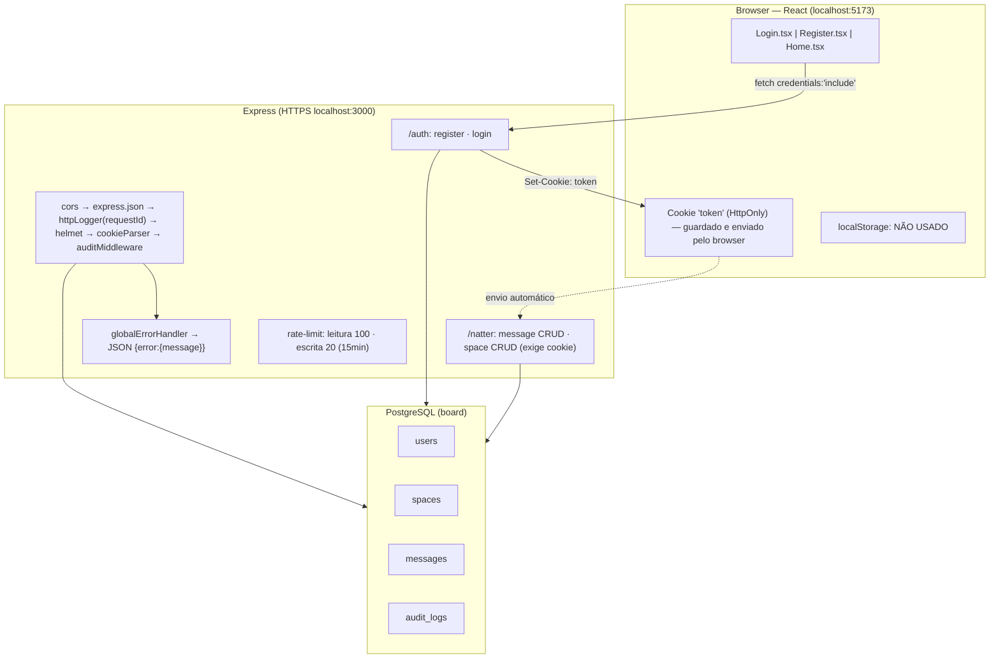
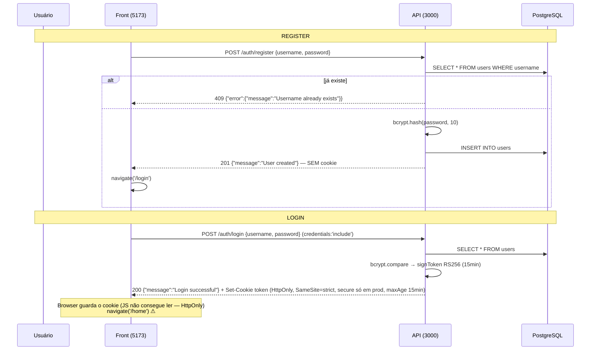

# Fluxos de dados e da API

## 1. Fluxo de dados geral

## 2. Sequência register → login (o caminho do cookie)

## 3. O que cada endpoint retorna

| Endpoint | Auth | Body | Sucesso | Erros |
|---|---|---|---|---|
| POST `/auth/register` | — | `{username, password}` | **201** `{message:"User created"}` | 409 `Username already exists` |
| POST `/auth/login` | — | `{username, password}` | **200** `{message:"Login successful"}` + **Set-Cookie `token`** | 401 `Invalid credentials` |
| POST `/natter/message` | cookie | `{content, space_id, author}` | **200** `{id, author, msg_time, msg_text, space_id}` | 400 · 401 · 429 |
| GET `/natter/message` | cookie | — | **200** `[{id, msg_time, msg_text}]` ⚠ sem author/space_id | 401 |
| GET `/natter/message/:id` | cookie | — | **200** `{id, author, msg_time, msg_text, space_id}` | 401 · 422 |
| PUT `/natter/message/:id` | cookie | `{content}` | **200** `{...message}` | 400 (content vazio) · 404 · 401 |
| DELETE `/natter/message/:id` | cookie | — | **204** corpo vazio | 401 |
| POST `/natter/space` | cookie | `{name, owner}` | **200** `{id, name, owner}` | 400 · 401 · 429 |
| GET `/natter/space` | cookie | — | **200** `[{id, name, owner}]` | 401 |
| GET `/natter/space/:id` | cookie | — | **200** `{id, name, owner}` | 401 · 422 |
| DELETE `/natter/space/:id` | cookie | — | **204** | 401 |

## 4. Cookies / localStorage

- **Único mecanismo de sessão: cookie `token`** (JWT RS256, 15min), setado pelo back no login. `HttpOnly` → o JS do front não lê nem altera; o browser envia sozinho nas requests para `localhost:3000`.
- **localStorage: não existe** em nenhum arquivo do front (`useAuth.ts` está vazio; Home é estática).
- O front **nunca chama** os endpoints `/natter` — o cookie é setado mas não é exercitado pela UI hoje.

## 5. Problemas reais que os diagramas expõem (front)

1. `Login.tsx:20` navega para `/home`, mas o `App.tsx` só tem `/`, `/login`, `/register` → tela em branco após login
2. `Login.tsx:23` e `Register.tsx:20` leem `data.message`, mas a API retorna `{error:{message}}` → erro nunca aparece na tela
3. Campo "email" do Register não envia nada; back só usa username/password